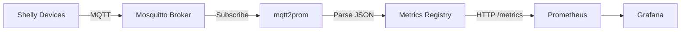

# mqtt2prom

MQTT to Prometheus exporter for Shelly IoT devices.

[](https://github.com/USERNAME/mqtt2prom/actions/workflows/ci.yml)
[](https://github.com/USERNAME/mqtt2prom/actions/workflows/security.yml)

## Features

- Subscribes to Shelly device MQTT topics
- Parses energy, power, voltage, and current metrics
- Exposes Prometheus-compatible metrics on `/metrics` endpoint
- Stateless container designed for Kubernetes deployment
- Support for Shelly Plug devices (H&T and Blu Gateway support planned)
- Auto-reconnects to MQTT broker on connection loss
- Comprehensive test coverage

## Supported Devices

- ✅ Shelly Plug US (energy monitoring)
- 🔜 Shelly H&T (humidity/temperature)
- 🔜 Shelly Blu Gateway (Bluetooth sensors)

## Message Types

- `NotifyFullStatus` - Full device snapshot (processed)
- `NotifyStatus` - Incremental updates with energy data (processed)
- `NotifyEvent` - Device events (ignored per spec)

## Metrics Exposed

| Metric | Type | Description | Labels |
|--------|------|-------------|--------|
| `shelly_switch_power_watts` | Gauge | Current power consumption in watts | device, switch |
| `shelly_switch_voltage_volts` | Gauge | Line voltage in volts | device, switch |
| `shelly_switch_current_amps` | Gauge | Current draw in amps | device, switch |
| `shelly_switch_energy_total_wh` | Gauge | Total energy consumed in watt-hours | device, switch |
| `shelly_switch_state` | Gauge | Switch output state (0=off, 1=on) | device, switch |
| `shelly_temperature_celsius` | Gauge | Device temperature in celsius | device |
| `shelly_wifi_rssi_dbm` | Gauge | WiFi signal strength in dBm | device |

## Usage

### Local Development

```bash
# Clone repository
git clone https://github.com/USERNAME/mqtt2prom.git
cd mqtt2prom

# Build
cargo build

# Run tests
cargo test

# Run with environment variables
export MQTT_HOST=mqtt.varshtat.com
export MQTT_PORT=1883
export MQTT_USERNAME=mqtt2prom
export MQTT_PASSWORD=<password>
export MQTT_TOPIC=mostert/shelly/#
export METRICS_PORT=8080
export RUST_LOG=info

cargo run
```

### Docker

```bash
# Build
docker build -t mqtt2prom:latest .

# Run
docker run -p 8080:8080 \
  -e MQTT_HOST=mqtt.varshtat.com \
  -e MQTT_PORT=1883 \
  -e MQTT_USERNAME=mqtt2prom \
  -e MQTT_PASSWORD=secret \
  -e MQTT_TOPIC=mostert/shelly/# \
  mqtt2prom:latest

# Check metrics
curl http://localhost:8080/metrics
curl http://localhost:8080/health
```

### Kubernetes

Deployment manifests are in the [varlab repository](https://github.com/USERNAME/varlab):

```
varlab/clusters/homelab/apps/teamwald/mqtt2prom/
```

Deploy using Flux GitOps:

```bash
cd varlab
git add clusters/homelab/apps/teamwald/mqtt2prom/
git commit -m "Add mqtt2prom exporter"
git push

flux reconcile kustomization apps --with-source
kubectl get pods -n teamwald -l app=mqtt2prom
```

## Configuration

All configuration is via environment variables:

| Variable | Required | Default | Description |
|----------|----------|---------|-------------|
| `MQTT_HOST` | Yes | - | MQTT broker hostname |
| `MQTT_PORT` | No | 1883 | MQTT broker port |
| `MQTT_USERNAME` | Yes | - | MQTT username |
| `MQTT_PASSWORD` | Yes | - | MQTT password |
| `MQTT_TOPIC` | No | `mostert/shelly/#` | MQTT topic pattern |
| `MQTT_CLIENT_ID` | No | `mqtt2prom` | MQTT client identifier |
| `METRICS_PORT` | No | 8080 | Prometheus metrics HTTP port |
| `RUST_LOG` | No | info | Log level (error, warn, info, debug, trace) |

## Architecture



### Components

1. **MQTT Subscriber** (`src/mqtt.rs`)
   - Connects to Mosquitto broker with auto-reconnect
   - Subscribes to `mostert/shelly/#` topic
   - Filters messages from `/events/rpc` topics
   - Parses Shelly JSON messages

2. **Message Parser** (`src/parser.rs`)
   - Deserializes JSON using serde
   - Extracts device metrics
   - Validates message types
   - Comprehensive test coverage

3. **Metrics Registry** (`src/metrics.rs`)
   - Prometheus metrics definitions using prometheus-client
   - Gauge metrics for power, voltage, current, energy
   - Labels: device_id (extracted from src), switch_id

4. **HTTP Server** (`src/server.rs`)
   - Axum server on port 8080
   - `/metrics` endpoint returns Prometheus text format
   - `/health` endpoint for liveness/readiness probes

## Development

### Prerequisites

- Rust 1.75+ (2021 edition)
- Docker (for container builds)
- MQTT broker (Mosquitto) for testing

### Build Commands

```bash
# Development build
cargo build

# Release build (optimized)
cargo build --release

# Run tests
cargo test

# Run tests with output
cargo test -- --nocapture

# Lint
cargo clippy

# Format
cargo fmt

# Check formatting
cargo fmt --check
```

### Testing MQTT Connection

```bash
# Subscribe to test messages (requires mqttx CLI)
mqttx sub -h mqtt.varshtat.com -u admin -P admin -t "mostert/shelly/#"

# In K8s cluster
kubectl port-forward -n mosquitto svc/mosquitto 1883:1883
```

## Deployment

### Release Process

1. **Update version in `Cargo.toml`**
2. **Commit changes**:
   ```bash
   git commit -am "Bump version to v0.1.0"
   ```
3. **Create and push tag**:
   ```bash
   git tag v0.1.0
   git push origin main
   git push origin v0.1.0
   ```
4. **GitHub Actions automatically**:
   - Builds multi-arch container (amd64, arm64)
   - Pushes to `ghcr.io/USERNAME/mqtt2prom:0.1.0`
   - Creates GitHub release

### Update Kubernetes Deployment

```bash
cd varlab
vim clusters/homelab/apps/teamwald/mqtt2prom/deployment.yaml
# Update: image: ghcr.io/USERNAME/mqtt2prom:v0.1.0

git commit -am "Deploy mqtt2prom v0.1.0"
git push

flux reconcile kustomization apps --with-source
```

## Monitoring

### Prometheus Queries

```promql
# Current power consumption
shelly_switch_power_watts{device="d48afc781ad8"}

# Total energy consumed
shelly_switch_energy_total_wh{device="d48afc781ad8"}

# Voltage
shelly_switch_voltage_volts{device="d48afc781ad8"}

# WiFi signal strength
shelly_wifi_rssi_dbm{device="d48afc781ad8"}
```

### Grafana Dashboard

Create dashboards to visualize:
- Power consumption over time
- Energy usage trends
- Device temperature
- WiFi signal strength

## Contributing

1. Fork the repository
2. Create a feature branch
3. Make changes with tests
4. Run `cargo test` and `cargo clippy`
5. Submit a pull request

## License

MIT OR Apache-2.0

## Related Projects

- [varlab](https://github.com/USERNAME/varlab) - Infrastructure and K8s manifests
- [Shelly API Documentation](https://shelly-api-docs.shelly.cloud/)
- [prometheus-client](https://github.com/prometheus/client_rust)

## Support

- Issues: [GitHub Issues](https://github.com/USERNAME/mqtt2prom/issues)
- Documentation: See [CLAUDE.md](CLAUDE.md) for development guidance
